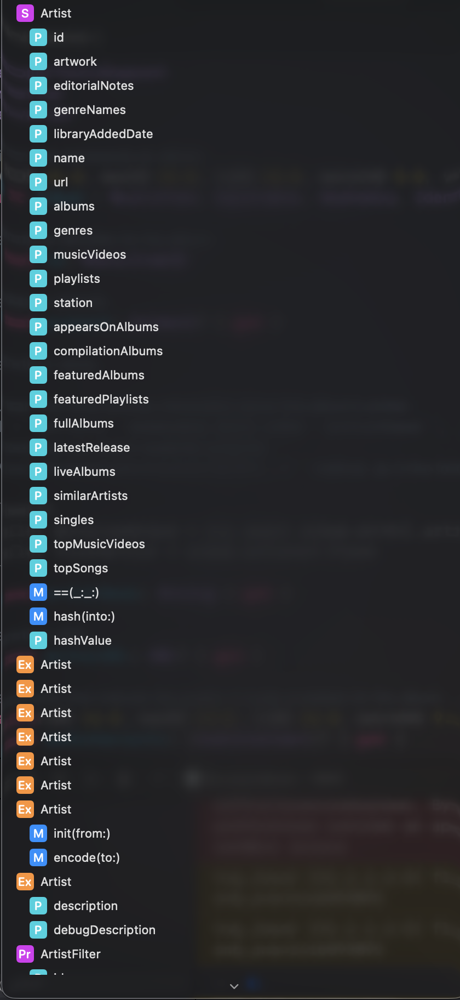

### Document 약어

- M (Method / 함수/메서드): * 클래스, 구조체, 익스텐션 내부에서 동작을 수행하는 함수(메서드)를 의미합니다.

- P (Property / 속성/변수): * 값을 저장하거나 제공하는 변수나 상수(프로퍼티)를 의미합니다.

- S (Struct / 구조체): * Swift의 구조체(Structure) 타입을 정의한 곳을 의미합니다.

- C (Class / 클래스): * Swift의 클래스(Class) 타입을 정의한 곳을 의미합니다.

- Pr (Protocol / 프로토콜): * 특정 자격 요건이나 메서드 청사진을 정의하는 프로토콜(Protocol)을 의미합니다.

- Ex (Extension / 익스텐션): * 기존 타입(클래스, 구조체 등)에 기능을 확장하는 익스텐션(Extension) 블록을 의미합니다.
