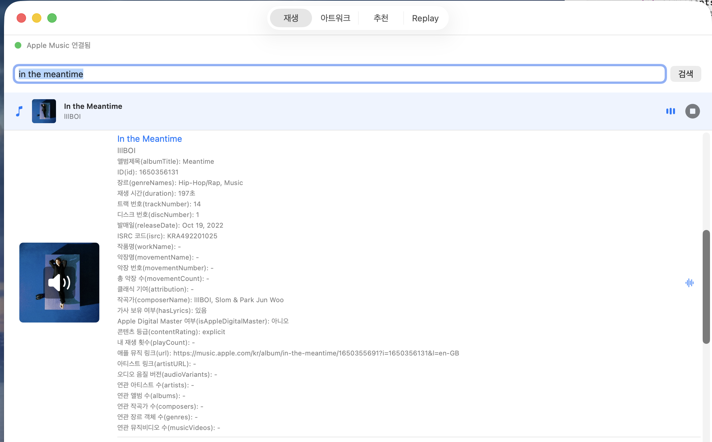
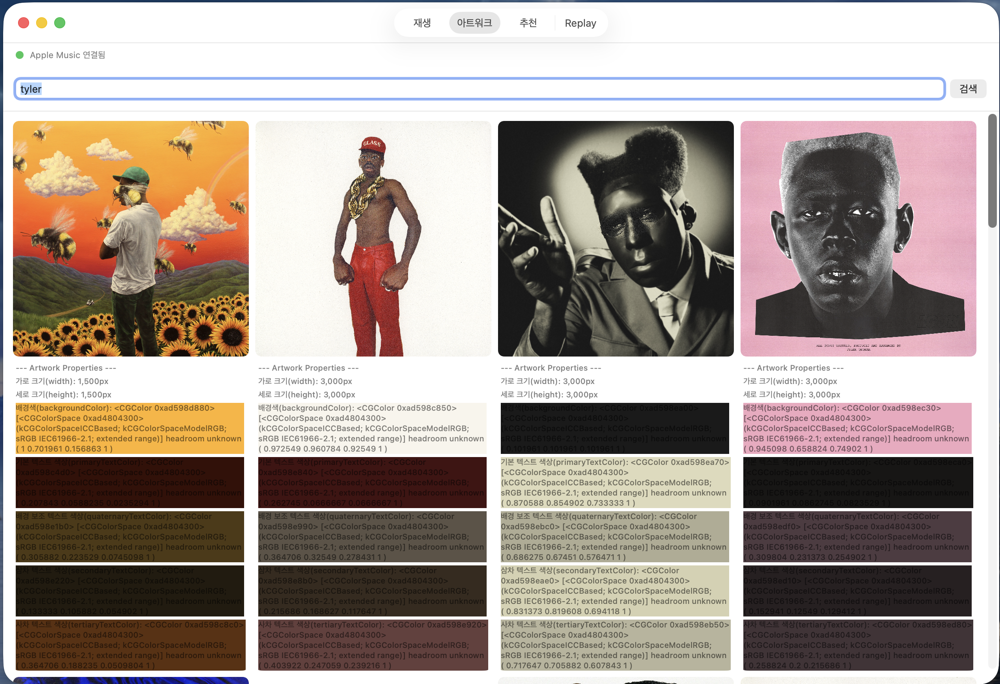
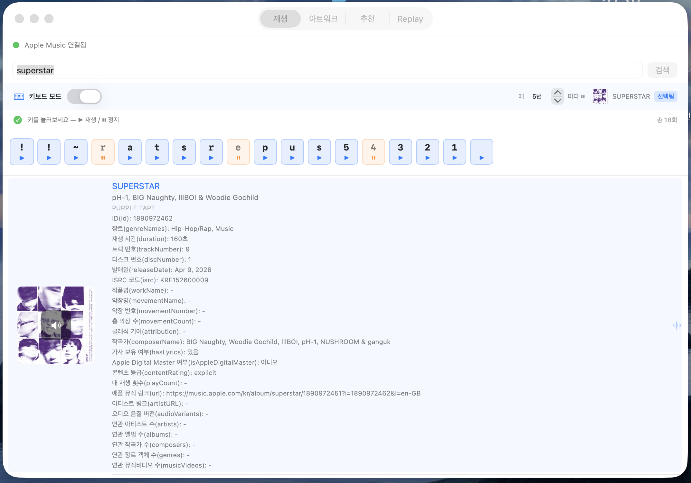

#  Sound and Music


## MusicKit ?!
- **Apple Music 콘텐츠를 검색하고, 메타데이터를 읽고, 재생하고, 사용자의 라이브러리와 상호작용하는 프레임워크**
-  MusicKit은 Apple Music API를 더 쉽게 사용하기 위한 프레임워크
- MusicKit에서는 음악 재생이 가능하다 
- 오디오 신호 자체를 자유롭게 다루는 오디오 처리 프레임워크는 아님!

📄 [MusicKit에 대하여](note/musickit.md)


__재밋어보이는 기능 리스트업__


- **아트워크** 
    - let backgroundColor: CGColor? 이미지의 평균 배경색.
    - let primaryTextColor: CGColor? 배경색이 표시될 경우 사용되는 기본 텍스트 색상.
    - <https://developer.apple.com/documentation/musickit/artwork>


- **musicsummaries**
    - 사용자가 지정된 기간 동안 가장 많이 들었던 앨범, 아티스트 및 노래 목록.
    - MusicKit은 아니고 Apple Music API 으로 지원
    - <https://developer.apple.com/documentation/applemusicapi/musicsummaries/views-data.dictionary>


---

## MusicKit 시작하기 !
[Apple Developer](https://developer.apple.com/kr/)
[개발자토큰 생성 안내](https://developer.apple.com/documentation/musickit/using-automatic-token-generation-for-apple-music-api)

1. **애플 개발자 계정에서 미디어 Identifiers와 개인 키를 생성**
    - Certificates, Identifiers & Profiles > Identifiers > Media IDs > 새로 생성
    - Certificates, Identifiers & Profiles > keys > 새로 생성 (Media Services (MusicKit, ShazamKit, Apple Music Feed))


2. **프로젝트의 App ID에 들어가 MusicKit 활성화**
    - 만약 배포 전이라 조회되지 않는다면?
        - App IDs를 직접 추가하기
            - Description: 앱 이름 / Bundle ID: 고유 식별자 (e.g., com.yourname.appname)
            - 만들고 있는 Xcode 프로젝트의 Bundle identifier에 똑같이 기입


3. **사용자 권한 요청 문구 추가 (Info.plist)**
    - Xcode 프로젝트 > Info탭 > 새로운 key 추가(+)
    - key name:  Privacy - Music Usage Description
    - value 에 안내문구 기입 (e.g., Apple Music 카탈로그 검색 및 음악 재생 기능을 제공하기 위해 음악 보관함 권한이 필요합니다.)


4. **macOS 앱 - 샌드박스(App Sandbox) 네트워크 설정 허용**
    - Targets > macOS > Signing & Capabilities > App Sandbox > Network: Outgoing Connections (Client)


---

## Preview

### 음악 재생 뷰
- Song의 모든 property를 출력해두었음.



`var artistName: String`
`var genreNames: [String]`
`var hasLyrics: Bool`
`let id: MusicItemID`
`var title: String`
를 제외하고는 `nil` !


- 음악 스트리밍하는 코드
```swift
// MARK: - 재생 제어

func playSong(_ song: Song) {
    let player = ApplicationMusicPlayer.shared
    player.queue = [song]
    nowPlayingSong = song
    isPlaying = true

    Task {
        do {
            try await player.play()
            print("재생 시작: \(song.title)")
        } catch {
            print("재생 실패: \(error.localizedDescription)")
            isPlaying = false
        }
    }
}
```

### 아트워크 뷰

- 아트워크 스트럭트의 property 출력
- 대체텍스트, 이미지 사이즈, 평균 색상, 보조색상 등


### 키보드 입력으로 재생/중단하기

- 키보드 모드: 키보드 입력으로 음악 재생과 일시중지를 제어하기
- 키보드 모드 on/off 가능
- n번 간격으로 중지하도록 설정 가능 (범위: [2,20])
- 다른 창으로 넘어와도 계속 키보드 입력 감지 가능하도록 함 `addGlobalMonitorForEvents`
